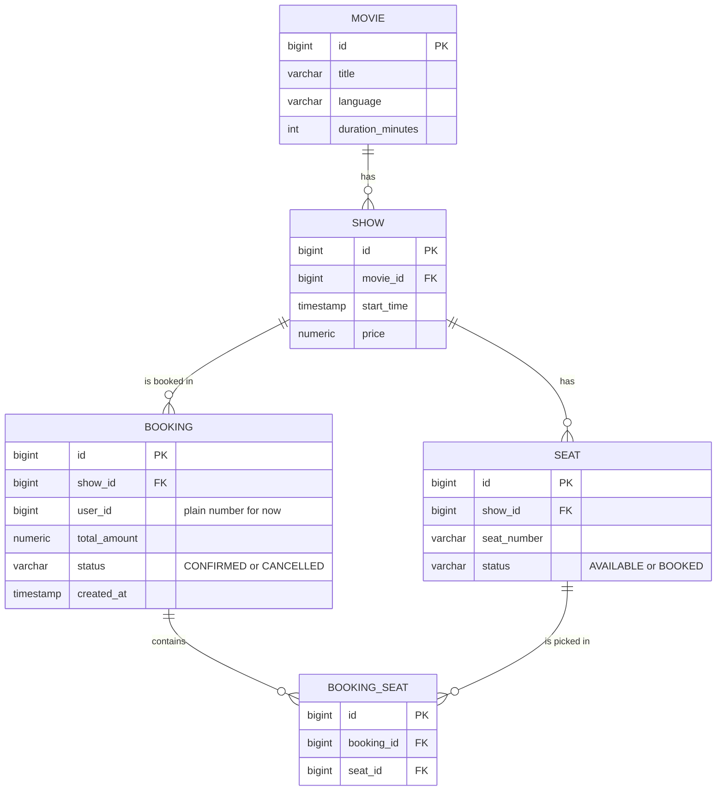

# Entity Diagram (Phase 1)

Five tables: `movies`, `shows`, `seats`, `bookings`, `booking_seats`.
`user_id` in `bookings` is a plain number for now. The User table arrives in Phase 5.

## ER diagram (Mermaid)



## Same diagram as plain text

```
MOVIE (1) ──────< SHOW (many)
                    │
                    ├──────< SEAT (many)
                    │           │
                    │           └──────< BOOKING_SEAT (many)
                    │                          │
                    └──────< BOOKING (many) ───┘
                                 (BOOKING (1) ──────< BOOKING_SEAT (many))
```

Read `A (1) ──< B (many)` as: one A has many B.

## All relations

| From | To | Type | Foreign key |
|---|---|---|---|
| Movie | Show | one to many | `shows.movie_id` |
| Show | Seat | one to many | `seats.show_id` |
| Show | Booking | one to many | `bookings.show_id` |
| Booking | BookingSeat | one to many | `booking_seats.booking_id` |
| Seat | BookingSeat | one to many | `booking_seats.seat_id` |
| Booking | Seat | many to many (through BookingSeat) | none directly |

## Each entity in simple statements

**Movie**
- One movie has many shows.
- A movie has no seats and no bookings of its own. It reaches them through its shows.

**Show**
- One show belongs to exactly one movie.
- One show has many seats (every show gets its own full set, like A1, A2, ...).
- One show can have many bookings.

**Seat**
- One seat belongs to exactly one show.
- One seat can appear in many `booking_seats` rows over time (for example booked, cancelled, then booked again by someone else).
- At any moment, a seat is in at most one active booking.

**Booking**
- One booking is for exactly one show.
- One booking contains many seats, through `booking_seats`.
- One booking reaches one movie, through its show (booking, then show, then movie).
- One booking belongs to one user (`user_id`, a plain number for now).

**BookingSeat**
- This is the link table between Booking and Seat.
- One row means: this seat is part of this booking.
- It belongs to exactly one booking and exactly one seat.

## One example in words

"Inception" (Movie) has a 7 PM show (Show). That show has seats A1, A2, A3 (Seat). Rahul books A1 and A2. That creates one Booking for the 7 PM show, and two BookingSeat rows: one for A1 and one for A2. The Booking reaches "Inception" through the show.
