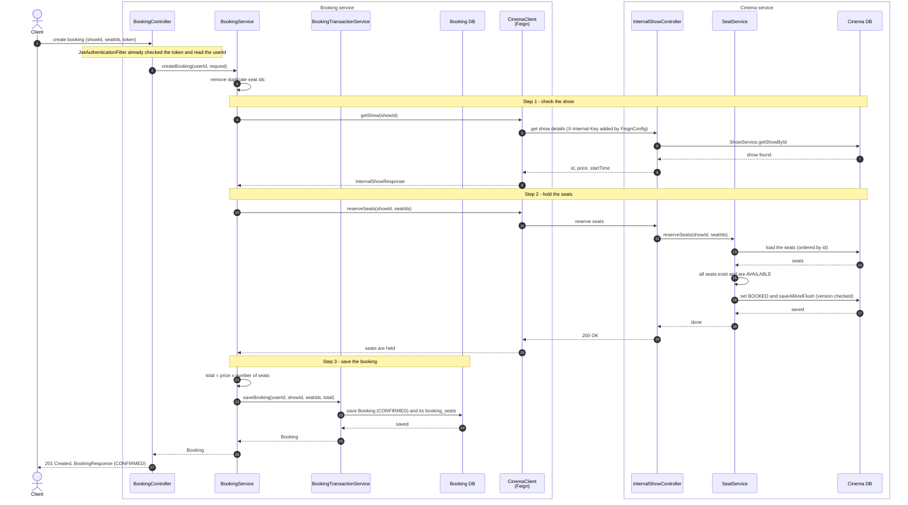
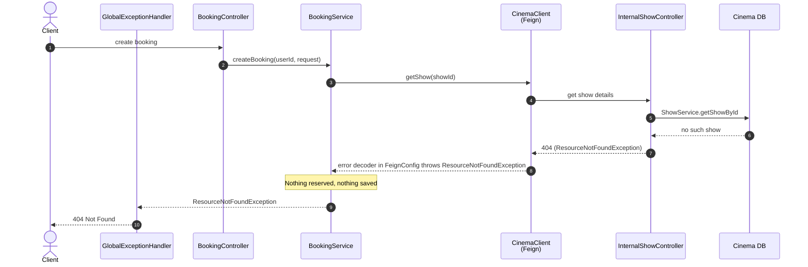
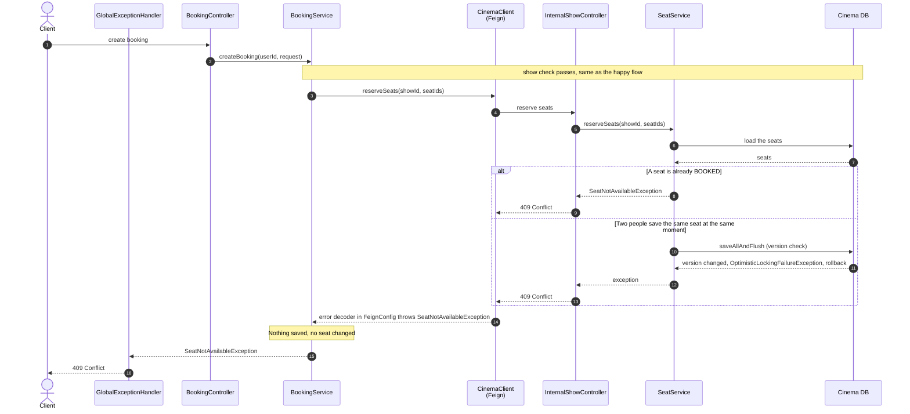
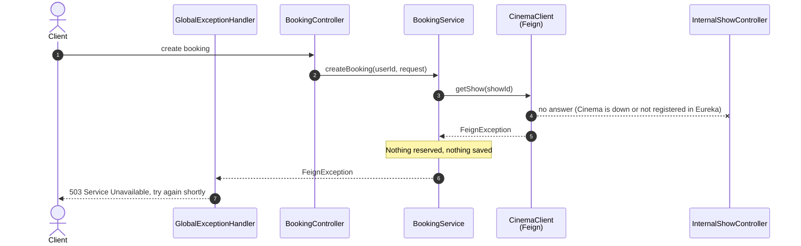
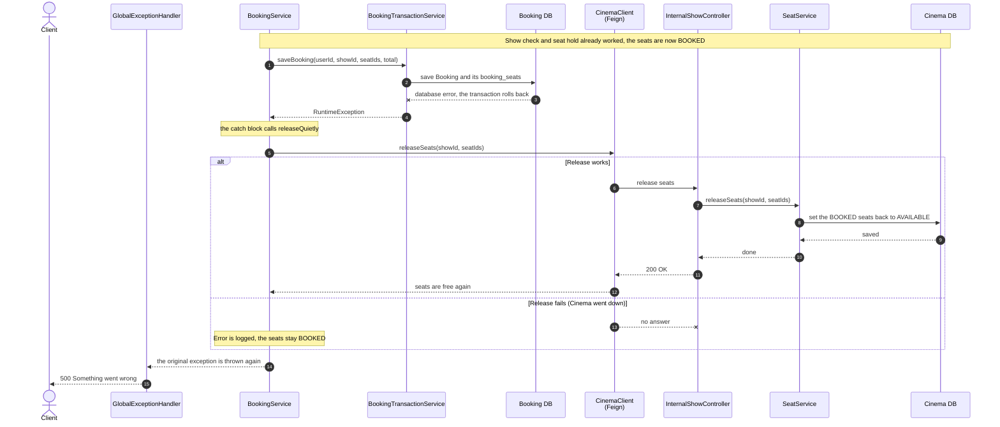

# Booking Flow (Phase 6)

How one booking travels through the system, from the user's request to "booking confirmed", and what happens when something goes wrong.

This file has two parts:

1. **The flow in simple words**, from the user to the API Gateway to the Booking service and back.
2. **Sequence diagrams** of how the services work inside, with class and method names. The Gateway is left out here.

---

# Part 1: The flow in simple words

## Who does what

- **API Gateway:** the front door. Every request from outside comes here first. It checks the login token. (It is built in Step 8.)
- **Booking service:** runs the booking. It owns the bookings database.
- **Cinema service:** owns shows and seats. It is the only service that can mark a seat as booked.

Each service has its own database. Booking never touches a seat row, it asks Cinema to do it.

## The big picture

```
User  ->  API Gateway  ->  Booking service  ->  Cinema service
                                  |                    |
                                  |   <-  answers  <-  |
                                  v
User  <-  API Gateway  <-  Booking confirmed
```

## Happy path: step by step

1. **The user sends a request.** They choose a show and some seats, and send the request with their login token.
2. **The API Gateway checks the token first.** If the token is fake or expired, the request stops here. If it is fine, the Gateway finds the Booking service by name and passes the request on, token included.
3. **The Booking service checks the token again.** It does not blindly trust the Gateway. It reads the user's id from the token, so nobody can book in someone else's name. It also checks the request itself, for example that at least one seat was chosen.
4. **Booking asks Cinema about the show.** Does the show exist? What does one seat cost?
5. **Booking asks Cinema to hold the seats.** Cinema checks that every chosen seat is free, then marks them all as booked. This is all or nothing: if even one seat is taken, none are changed.
6. **Booking saves the order.** It works out the total (seat price times number of seats) and saves the booking in its own database as CONFIRMED.
7. **The answer goes back.** Booking replies, the Gateway passes it on, and the user sees "booking confirmed".

## When something goes wrong

| What goes wrong | Where it is caught | What the user sees | What happens to the seats |
|---|---|---|---|
| Not logged in, or the token is bad or expired | Gateway (and Booking again) | 401 Unauthorized | Nothing happens |
| The request is incomplete, for example no seats | Booking | 400 Bad Request | Nothing happens |
| The show does not exist | Cinema | 404 Not Found | Nothing happens |
| A seat does not exist, or belongs to another show | Cinema | 404 Not Found | Nothing changes |
| A seat is already booked | Cinema | 409 Conflict | Nothing changes |
| Two people pick the same seat at the same moment | Cinema | One of them gets the seat, the other gets 409 and "please try again" | Only the winner's booking goes through |
| Cinema is down or too slow | Booking | 503 "try again shortly" | Nothing happens |
| Seats are held, but Booking cannot save the order | Booking | 500 "Something went wrong" | Booking tells Cinema to free the seats, so they are free again |
| The seats are held, the save fails, **and** freeing them also fails | Booking | 500 "Something went wrong" | The seats stay booked with no booking behind them |

The last row is the weak spot. It is safe, because nobody can double-book those seats, but they are lost sales until someone frees them by hand. Phase 7 (the saga) is built to close this gap.

---

# Part 2: Sequence diagrams (inside the services)

These start at the Booking controller. The API Gateway is not shown.

Names used in the diagrams:

- **BookingController:** receives the request. `JwtAuthenticationFilter` has already checked the token before it runs.
- **BookingService:** the main logic. It talks to Cinema and decides what to do on failure.
- **BookingTransactionService:** saves the booking in one database transaction.
- **CinemaClient:** the Feign interface Booking uses to call Cinema over the network.
- **InternalShowController:** Cinema's entry point for other services.
- **SeatService:** Cinema's seat logic, including the version check on each seat.
- **GlobalExceptionHandler:** turns exceptions into clean error answers.

## 2.1 Happy flow



Two things to notice:

- The Cinema calls (steps 1 and 2) happen **outside** any database transaction in Booking. Booking's own transaction only covers the final save, so a database connection is never held while waiting on the network.
- Seats are loaded in id order on purpose. Two bookings that want the same seats always lock them in the same order, so they cannot block each other in a circle (deadlock).

## 2.2 Failure flow A: the show does not exist

The request stops at the first Cinema call. Nothing was reserved and nothing was saved.



The same 404 happens when a seat id does not exist, or belongs to another show. That check is in `SeatService.reserveSeats`, and the answer travels back along the same path.

## 2.3 Failure flow B: the seat is taken

There are two ways to get here. Either the seat was already booked when Cinema looked, or two people tried to save the same seat at the same moment.



How the second case works: each seat has a version number. Both requests read the seat as free. The first one to save adds "and version = 1" to its update and wins, which bumps the version. The second one's update finds no row with the old version, so it fails. The whole Cinema transaction rolls back, so none of that request's seats are changed.

## 2.4 Failure flow C: Cinema is down

Booking cannot reach Cinema, so it cannot continue. Nothing was reserved and nothing was saved.



## 2.5 Failure flow D: the seats are held, but the booking cannot be saved

This is the dangerous one. The seats are already marked booked in Cinema, but Booking's own database save failed. Booking has to undo what Cinema did.



Why it is built this way:

- **Release can be repeated safely.** `SeatService.releaseSeats` skips seats that are already free, so a retry does no harm.
- **If the release fails, the seats stay booked.** That wastes seats but never causes a double booking. Freeing seats for a booking that does not exist would be the worse mistake, so the code errs on the side of keeping them blocked.
- **This gap is known.** There are two databases and no shared transaction, so Booking and Cinema can briefly disagree. Phase 7 (events, saga and outbox) is what removes the manual step.

---

## Not covered here

- **Cancelling a booking.** It is the same idea in reverse: Booking marks the order cancelled first, then asks Cinema to free the seats.
- **Payment.** Payment is its own service for now and is not part of this flow. It is connected through events in Phase 7.
