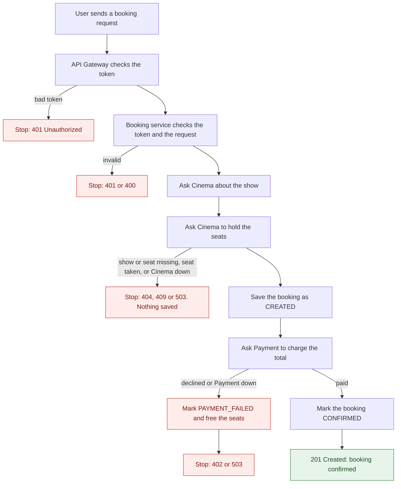
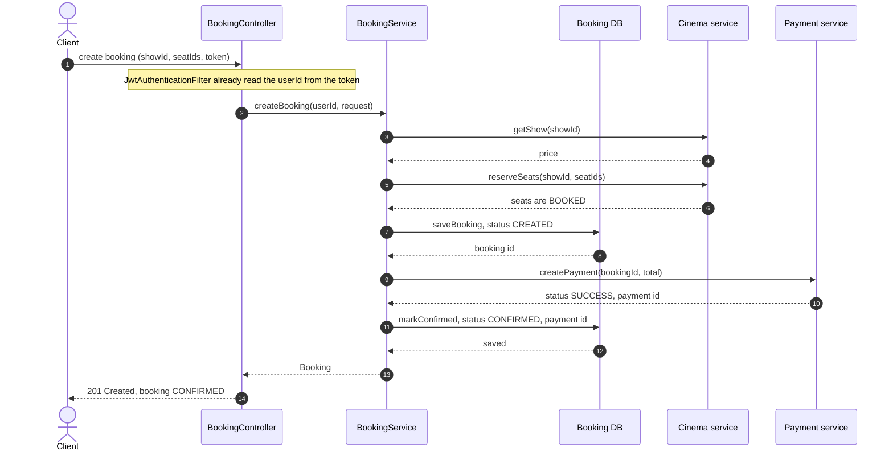
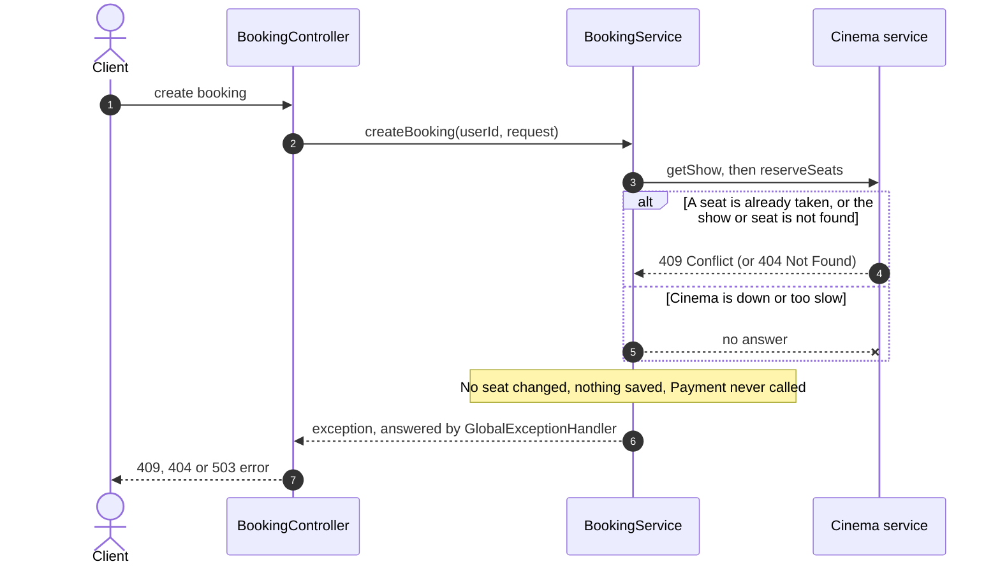
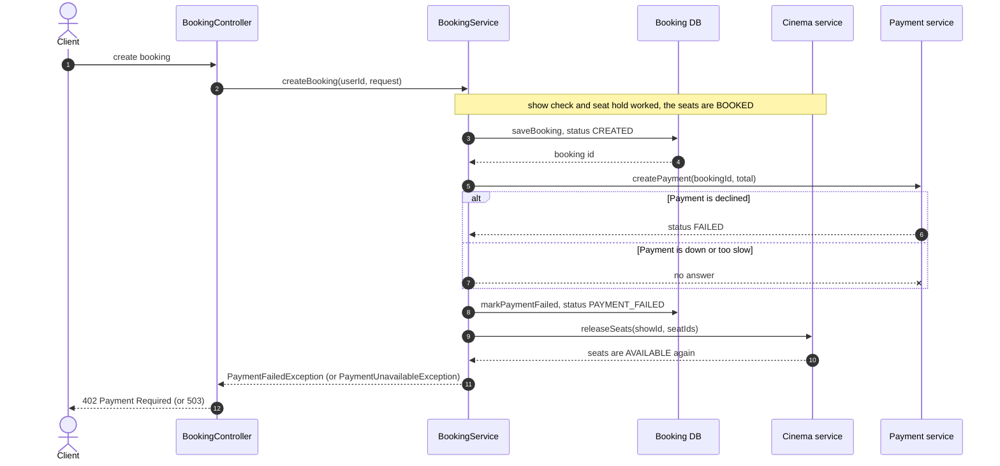

# Booking Flow (Phase 6, with Payment connected)

How one booking travels through the system, from the user's request to "booking confirmed", and what happens when something goes wrong.

This file has three parts:

1. **The flow in simple words**, with a flow diagram, from the user to the API Gateway to the Booking service and back.
2. **Old flow and new flow**, so you can compare them later with the event-driven version in Phase 7.
3. **Sequence diagrams** of how the services work inside. The Gateway is left out here. There is one happy flow and two bad flows.

---

# Part 1: The flow in simple words

## Who does what

- **API Gateway:** the front door. Every request from outside comes here first. It checks the login token.
- **Booking service:** runs the booking. It owns the bookings database and decides what each answer means.
- **Cinema service:** owns shows and seats. It is the only service that can mark a seat as booked or free.
- **Payment service:** charges the money through a fake gateway and records the result.

Each service has its own database. Booking never touches a seat row or a payment row, it asks Cinema and Payment.

## Flow diagram

## Happy path: step by step

1. **The user sends a request.** They choose a show and some seats, and send the request with their login token.
2. **The API Gateway checks the token first.** A fake or expired token stops here. Otherwise the Gateway finds the Booking service by name and passes the request on, token included.
3. **The Booking service checks the token again.** It does not blindly trust the Gateway. It reads the user's id from the token, so nobody can book in someone else's name. It also checks the request itself, for example that at least one seat was chosen.
4. **Booking asks Cinema about the show.** Does the show exist? What does one seat cost?
5. **Booking asks Cinema to hold the seats.** Cinema checks that every chosen seat is free, then marks them all as booked. This is all or nothing: if even one seat is taken, none are changed.
6. **Booking saves the order as CREATED.** It works out the total (seat price times number of seats) and saves the booking in its own database. CREATED means: seats are held, payment is next. Payment needs the booking's id, so the booking must exist first.
7. **Booking asks Payment to charge the total.** Payment records the attempt and asks the fake gateway.
8. **Payment answers SUCCESS.** Booking sets the booking to CONFIRMED and stores the payment's id.
9. **The answer goes back.** Booking replies, the Gateway passes it on, and the user sees "booking confirmed".

## When something goes wrong

| What goes wrong | Where it is caught | What the user sees | What happens to the booking and the seats |
|---|---|---|---|
| Not logged in, or the token is bad or expired | Gateway (and Booking again) | 401 Unauthorized | Nothing happens |
| The request is incomplete, for example no seats | Booking | 400 Bad Request | Nothing happens |
| The show does not exist | Cinema | 404 Not Found | Nothing happens |
| A seat does not exist, or belongs to another show | Cinema | 404 Not Found | Nothing changes |
| A seat is already booked | Cinema | 409 Conflict | Nothing changes |
| Two people pick the same seat at the same moment | Cinema | One of them gets the seat, the other gets 409 and "please try again" | Only the winner's booking goes on |
| Cinema is down or too slow | Booking | 503 "try again shortly" | Nothing is saved |
| **Payment is declined** | Booking | **402 Payment Required** | Booking becomes PAYMENT_FAILED, the seats are freed |
| **Payment is down or too slow** | Booking | **503 "try again shortly"** | Booking becomes PAYMENT_FAILED, the seats are freed |
| Seats are held, but Booking cannot save the order | Booking | 500 "Something went wrong" | Booking tells Cinema to free the seats |
| The seats are held, the booking fails, **and** freeing them also fails | Booking | 500 or 402 or 503 | The seats stay booked with no confirmed booking behind them |

A failed payment leaves the booking row in the database as PAYMENT_FAILED. That is on purpose: the user can see the attempt in "my bookings", and the seats are free for someone else.

## Known gaps (left on purpose)

- **Seats stuck after a failed release.** If Cinema cannot be reached to free the seats, they stay booked. It is safe, because nobody can double-book them, but those seats are lost sales until someone frees them by hand.
- **Money taken, but Booking never heard.** If Payment charges and its reply is lost, Booking treats the booking as failed and frees the seats. Idempotency keys and a refund come in Phase 7 and Phase 8.
- **Paid, but the final save failed.** If the payment succeeded and Booking then cannot set CONFIRMED, the booking stays CREATED and an error is logged.
- **Cancel does not refund yet.** Only a CONFIRMED booking can be cancelled. The refund arrives in Phase 7.

All of these exist because three services and two databases cannot share one transaction. Phase 7 (events, saga and outbox) is built to close them.

---

# Part 2: Old flow and new flow

**Before (Phase 6, first version)**
1. Check the show.
2. Hold the seats.
3. Save the booking as CONFIRMED.
4. Nobody paid. Payment was a separate service, linked only by hand in Postman.

**Now (Phase 6, Payment connected)**
1. Check the show.
2. Hold the seats.
3. Save the booking as CREATED.
4. Call Payment and wait for the answer.
5. Set CONFIRMED, or set PAYMENT_FAILED and free the seats.
6. It is one long request. The user waits for every step, and a slow service slows everything.

**Phase 7 (preview)**
- The same steps and the same statuses, but each service reacts to events instead of waiting for a reply.
- The user gets the booking back as CREATED at once, and the status changes later, when the payment event arrives.
- Failures are undone by compensating events (a saga), not by the catch blocks in `BookingService`.

---

# Part 3: Sequence diagrams (inside the services)

These start at the Booking controller. The API Gateway is not shown.

Names used in the diagrams:

- **BookingController:** receives the request. `JwtAuthenticationFilter` has already checked the token before it runs.
- **BookingService:** the main logic. It calls Cinema and Payment, and decides what to do on failure.
- **Booking DB:** Booking's own database, written through `BookingTransactionService`.
- **Cinema service** and **Payment service:** shown as one box each. Booking reaches them through its Feign clients, `CinemaClient` and `PaymentClient`.

## 3.1 Happy flow

Two things to notice:

- The calls to Cinema and Payment happen **outside** any database transaction in Booking. Each save is its own short transaction, so a database connection is never held while waiting on the network.
- The booking is saved as CREATED **before** Payment is called, because Payment needs the booking's id.

## 3.2 Bad flow 1: Cinema cannot hold the seats

This covers a seat that is already taken, a show or seat that does not exist, and Cinema being down. It stops before anything is saved, so Payment is never called.

When two people pick the same seat at the same moment, Cinema's version check lets only the first save win. The other one gets the same 409.

## 3.3 Bad flow 2: Payment fails

The seats are already held and the booking is saved as CREATED. Booking now has to undo what it did: mark the booking failed and free the seats.

Why it is built this way:

- **Database first, seats after.** If freeing the seats fails, they stay booked, which is safe. The other order could free seats for a booking that still looks alive.
- **Release can be repeated.** `SeatService.releaseSeats` skips seats that are already free.
- **The failed booking stays visible.** It remains in the database as PAYMENT_FAILED, so the user sees what happened.

---

## Not covered here

- **Cancelling a booking.** It is the same idea in reverse: Booking marks the order CANCELLED first, then asks Cinema to free the seats. Only a CONFIRMED booking can be cancelled, and the refund is added in Phase 7.