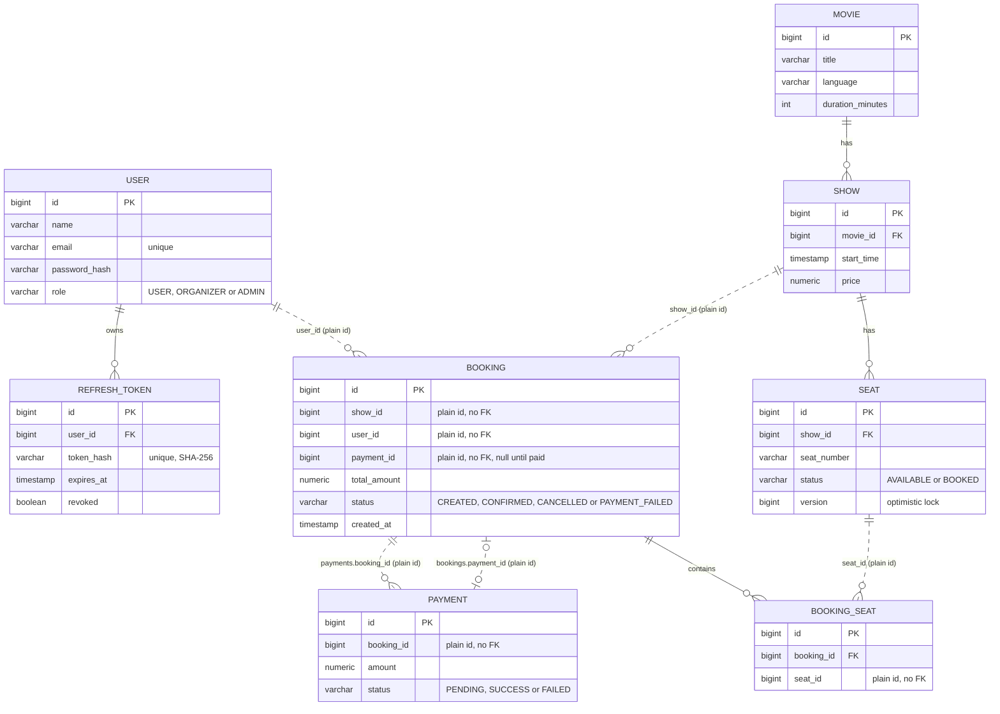
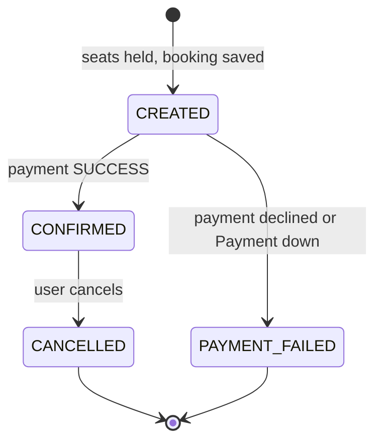

# Entity Diagram (Phase 6: Microservices, with Payment connected)

Four databases, one for each service that stores data. Eight tables in total.

| Service | Database | Tables |
|---|---|---|
| user-service | `userdb` | `users`, `refresh_tokens` |
| cinema-service | `cinemadb` | `movies`, `shows`, `seats` |
| booking-service | `bookingdb` | `bookings`, `booking_seats` |
| payment-service | `paymentdb` | `payments` |

notification-service has no table yet.

Rule: a foreign key exists only between tables in the same database.
When a table points to another service's table, it stores a plain id, and the service must ask the owner through an API.

## ER diagram (Mermaid)

Solid line = real foreign key inside one database.
Dashed line = plain id across services, no foreign key.



## Same diagram as plain text

```
user-service (userdb)
  USER (1) ──────< REFRESH_TOKEN (many)

cinema-service (cinemadb)
  MOVIE (1) ──────< SHOW (many) ──────< SEAT (many)

booking-service (bookingdb)
  BOOKING (1) ──────< BOOKING_SEAT (many)

payment-service (paymentdb)
  PAYMENT (many)

Across services (plain ids only, no foreign keys):
  BOOKING.user_id         ····> USER.id          (user-service)
  BOOKING.show_id         ····> SHOW.id          (cinema-service)
  BOOKING.payment_id      ····> PAYMENT.id       (payment-service)
  BOOKING_SEAT.seat_id    ····> SEAT.id          (cinema-service)
  PAYMENT.booking_id      ····> BOOKING.id       (booking-service)
```

Read `A (1) ──< B (many)` as: one A has many B.
Read `A ····> B` as: A stores B's id, but the database does not enforce it.

## All relations

| From | To | Type | Link | Enforced by |
|---|---|---|---|---|
| User | RefreshToken | one to many | `refresh_tokens.user_id` | foreign key |
| Movie | Show | one to many | `shows.movie_id` | foreign key |
| Show | Seat | one to many | `seats.show_id` | foreign key |
| Booking | BookingSeat | one to many | `booking_seats.booking_id` | foreign key |
| User | Booking | one to many | `bookings.user_id` | plain id (was a foreign key) |
| Show | Booking | one to many | `bookings.show_id` | plain id (was a foreign key) |
| Seat | BookingSeat | one to many | `booking_seats.seat_id` | plain id (was a foreign key) |
| Booking | Payment | one to many | `payments.booking_id` | plain id (new) |
| Payment | Booking | zero or one to one | `bookings.payment_id` | plain id (new) |
| Booking | Seat | many to many (through BookingSeat) | none | plain id |

## Booking status



Rules that go with it:
- The seats are BOOKED in Cinema while a booking is CREATED or CONFIRMED.
- The seats are freed when a booking becomes PAYMENT_FAILED or CANCELLED.
- Only a CONFIRMED booking can be cancelled. For the other statuses the seats were already freed, and freeing them again could free seats that someone else has booked since.
- `payment_id` is filled only when the booking becomes CONFIRMED.

## What changed from the monolith

- Three foreign keys were removed: `bookings.show_id`, `bookings.user_id` and `booking_seats.seat_id`. Their columns stay, but the database no longer checks them.
- In Java, `Booking.show` becomes `Long showId`, and `BookingSeat.seat` becomes `Long seatId`.
- One new table, `payments`, in its own database.
- Payment is now part of the booking flow:
    - `bookings` gets `payment_id`, a plain id with no foreign key.
    - `bookings.status` gets two new values, CREATED and PAYMENT_FAILED.
- `seats` gains `version` (Phase 4, optimistic locking), and `users` and `refresh_tokens` (Phase 5) are now part of the diagram.

## What we lose without foreign keys

- The database no longer stops a booking from pointing to a show or a payment that does not exist.
- So Booking calls Cinema to check the show before it saves anything, and it only stores a payment id that Payment itself returned.
- Deleting a show, user or payment would not warn the booking tables, so we never delete them (the plan already leaves delete for later).
- You cannot join `bookings` with `shows` or `payments` in one SQL query. To show "booking with movie title", Booking asks Cinema through its API.

## Each entity in simple statements

**User** (user-service)
- One user has many refresh tokens, because each login creates a new one.
- A user does not know about bookings. Booking stores the user's id only.

**RefreshToken** (user-service)
- Belongs to exactly one user.
- Stores a hash of the token, never the token itself.

**Movie** (cinema-service)
- One movie has many shows.
- A movie has no seats and no bookings of its own. It reaches seats through its shows.

**Show** (cinema-service)
- One show belongs to exactly one movie.
- One show has many seats (every show gets its own full set, like A1, A2, ...).
- A show does not know about bookings. Booking stores the show's id only.

**Seat** (cinema-service)
- One seat belongs to exactly one show.
- Cinema owns the seat status. Booking asks Cinema to reserve or release a seat.
- At any moment, a seat is in at most one active booking.

**Booking** (booking-service)
- One booking is for one show and one user, stored as plain ids.
- One booking contains many seats, through `booking_seats`.
- It starts as CREATED (seats held, waiting for payment) and becomes CONFIRMED when Payment answers SUCCESS.
- It stores the payment's id once paid. Everything else about the payment stays in Payment.
- To know the movie title or price, Booking asks Cinema.

**BookingSeat** (booking-service)
- The link between a booking and a seat.
- One row means: this seat id is part of this booking.
- It has a real foreign key to its booking, and a plain id for the seat.

**Payment** (payment-service)
- One payment is for one booking, stored as a plain id.
- In the current flow Booking makes one payment attempt per booking. The model allows more, for example a retry or a refund in Phase 7.
- Payment does not know the booking's status. Booking decides what a SUCCESS or FAILED answer means.

## One example in words

"Inception" (Movie, in cinema-service) has a 7 PM show with seats A1, A2, A3. Rahul (User, in user-service) books A1 and A2.
Booking asks Cinema for the show's price and to reserve seats A1 and A2. Then Booking saves one Booking row in its own database, with status CREATED, holding `show_id` and `user_id` as plain numbers, and two BookingSeat rows holding the seat ids.
Booking then asks Payment to charge the total. Payment saves one Payment row holding the booking's id as a plain number, and answers SUCCESS.
Booking sets its row to CONFIRMED and stores the payment's id in `payment_id`.
If Payment had answered FAILED, Booking would set the row to PAYMENT_FAILED and ask Cinema to free A1 and A2.
No database holds a foreign key to another service's tables. The services are linked only through API calls.