# Ticket Booking System: ER Diagram, Phase by Phase

Each phase lists what was **added**, **changed**, and **removed** in the database, then shows the schema after that phase.

- Phases 1 to 5 are one app with one database.
- From Phase 6, each service owns its own database, so there is one diagram per service.
- Column names use `snake_case`. The Java fields use `camelCase` (for example `seat_number` is `seatNumber`).
- The user table is called `users` because `user` is a reserved word in PostgreSQL.
- Money is `decimal` in the database and `BigDecimal` in Java.
- Migrations are Flyway files. The version numbers below are suggestions.

---

## Phase 0: Requirements and Design

- No tables. The design lives on paper (this file).

---

## Phase 1: Basic CRUD

**Added:** `movie`, `show`, `seat`, `booking`, `booking_seat`

**Changed:** nothing (starting point)

**Removed:** nothing

**Migrations**
- `V1__create_core_tables.sql`
- `V2__seed_sample_movies.sql`

**Design notes**
- `booking.user_id` is a plain number. There is no `users` table yet, so there is no foreign key.
- Each show gets its own seat rows, so "A1" in one show is independent of "A1" in another.

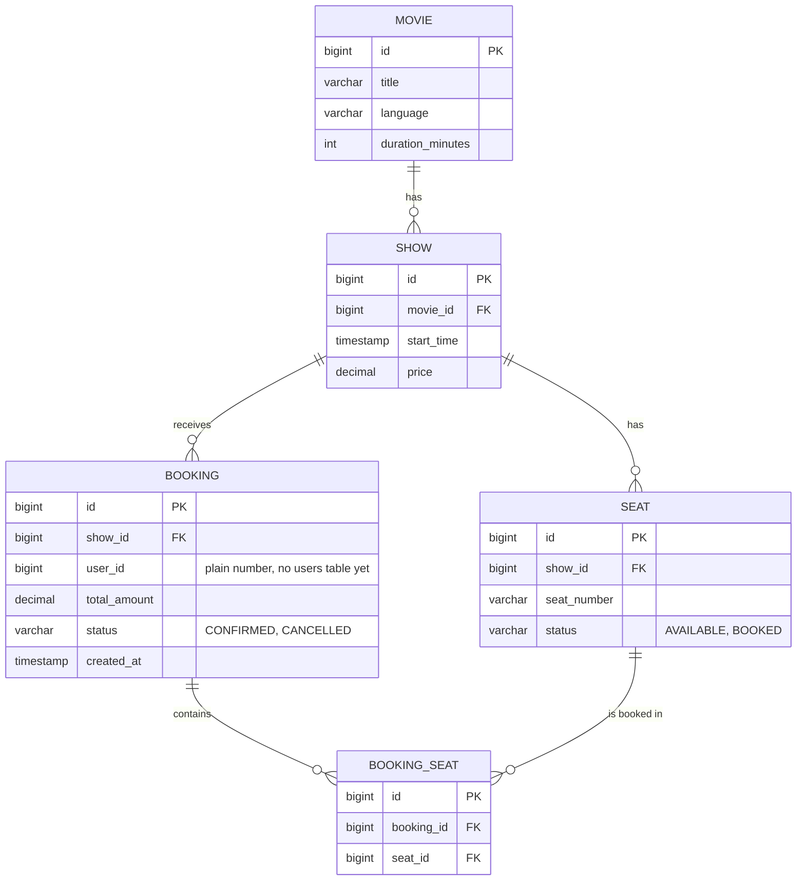

---

## Phase 2: Transactions and Error Handling

**Added:** nothing

**Changed:** nothing

**Removed:** nothing

- DTOs, exceptions, and validation are Java code, not tables.
- The schema is the same as Phase 1.

---

## Phase 3: Database Performance

**Added:** no new tables. Only data and indexes.

**Changed:** nothing in the columns

**Removed:** nothing

**Migrations**
- `V3__seed_large_data.sql` (100,000+ movies, shows, and seats)
- `V4__add_indexes.sql`

**Indexes to consider** (add each one only after `EXPLAIN ANALYZE` shows a full scan)
- `movie.title`: a trigram (`pg_trgm`) GIN index, so `LIKE '%name%'` search is fast
- `show.movie_id`: for listing the shows of a movie
- `seat.show_id` (or composite `show_id, status`): for listing seats of a show
- `booking.user_id`: for listing a user's bookings (used from Phase 5)
- `booking_seat.booking_id`: for loading the seats of a booking

The ER diagram does not change. Indexes are not drawn in it.

---

## Phase 4: Concurrency and Locking

**Added:** nothing

**Changed:** `seat` gets a `version` column

**Removed:** nothing

**Migration**
- `V5__add_seat_version.sql`

Only the changed table is shown here. The rest of the schema is the same as Phase 1.

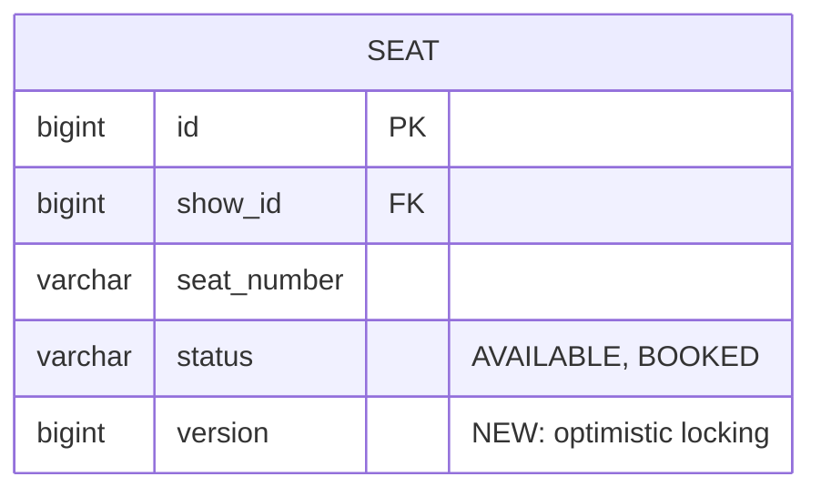

---

## Phase 5: Security (JWT and Roles)

**Added:** `users`, `refresh_token`

**Changed:** `booking.user_id` is now a real foreign key to `users.id`

**Removed:** nothing is dropped. The old "plain number" rule for `user_id` is gone.

**Migrations**
- `V6__create_users_and_refresh_token.sql`
- `V7__booking_user_foreign_key.sql`

**Watch out:** old test bookings with made-up `user_id` values will break the new foreign key. Delete the test bookings, or insert matching users first.

This is the final schema of the monolith (7 tables).

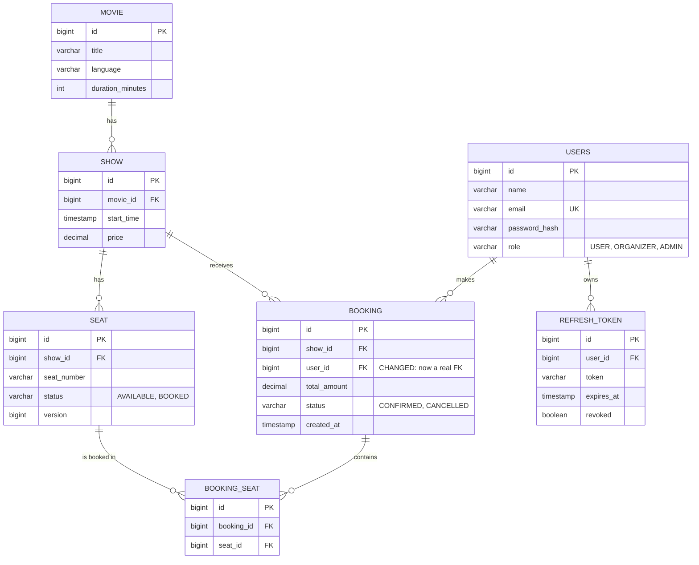

---

## Phase 6: Microservices Split

**Added:** `payment` (in the new Payment service)

**Changed**
- One database becomes four, one per service.
- `booking.show_id`, `booking.user_id`, and `booking_seat.seat_id` become plain numbers.
- `payment.booking_id` is a plain number.

**Removed**
- Foreign key `booking.show_id` to `show`
- Foreign key `booking.user_id` to `users`
- Foreign key `booking_seat.seat_id` to `seat`
- Cross-service joins. Booking now calls Cinema for price and seat updates.

**Migrations:** each service has its own Flyway folder. Move the tables that belong to it, and drop the cross-service foreign keys.

**Seat ownership:** this plan assumes Cinema owns seat status, which matches the internal reserve and release endpoints. Confirm this in Phase 6, Step 1.

**Services and tables**
- User service: `users`, `refresh_token`
- Cinema service: `movie`, `show`, `seat`
- Booking service: `booking`, `booking_seat`
- Payment service: `payment`
- Notification service: no table yet

### User service database

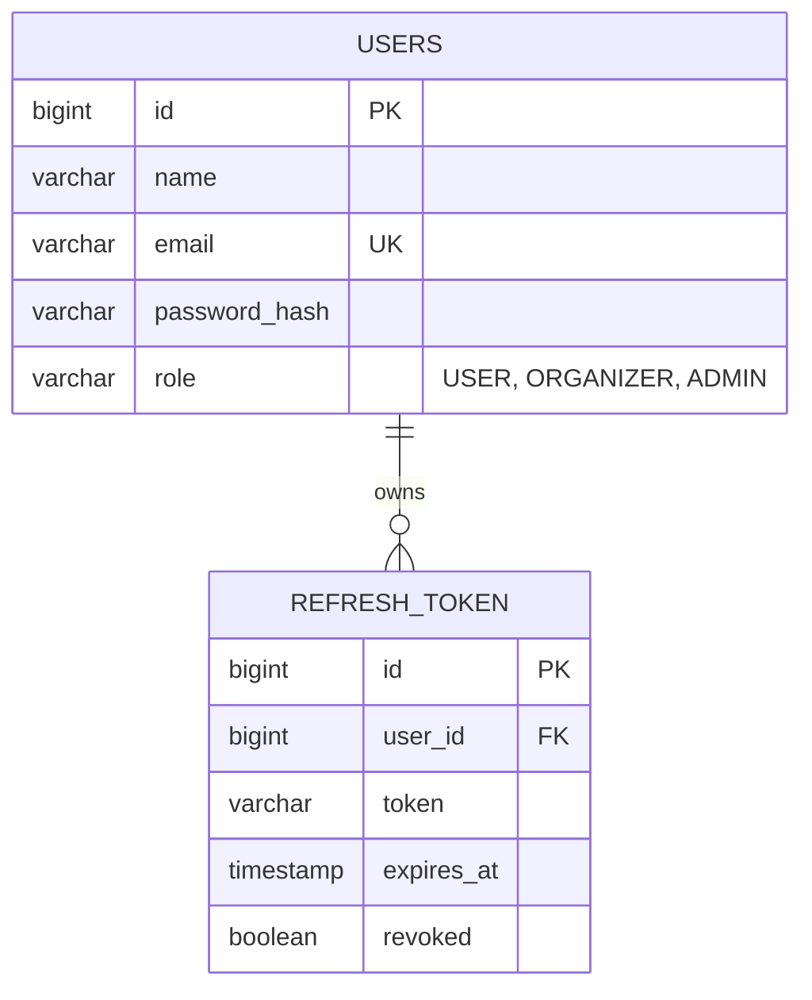

### Cinema service database

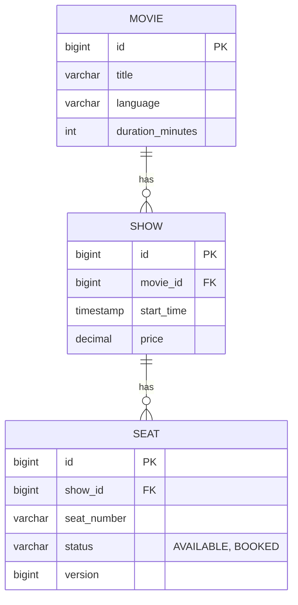

### Booking service database

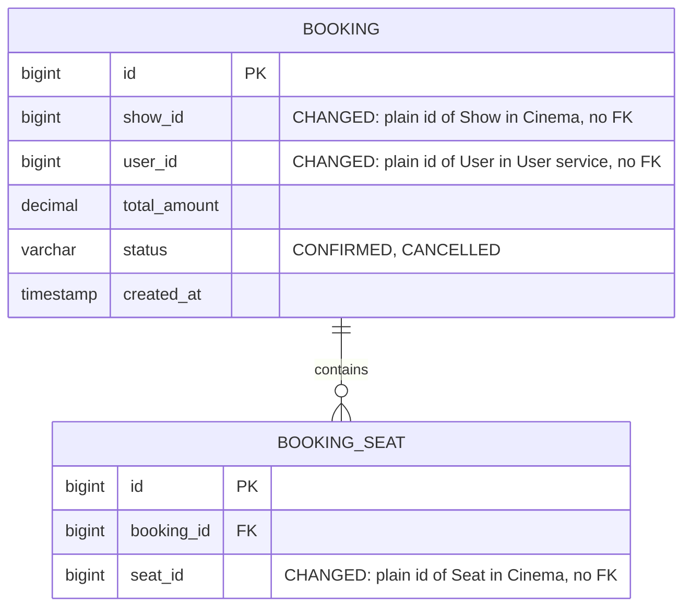

### Payment service database

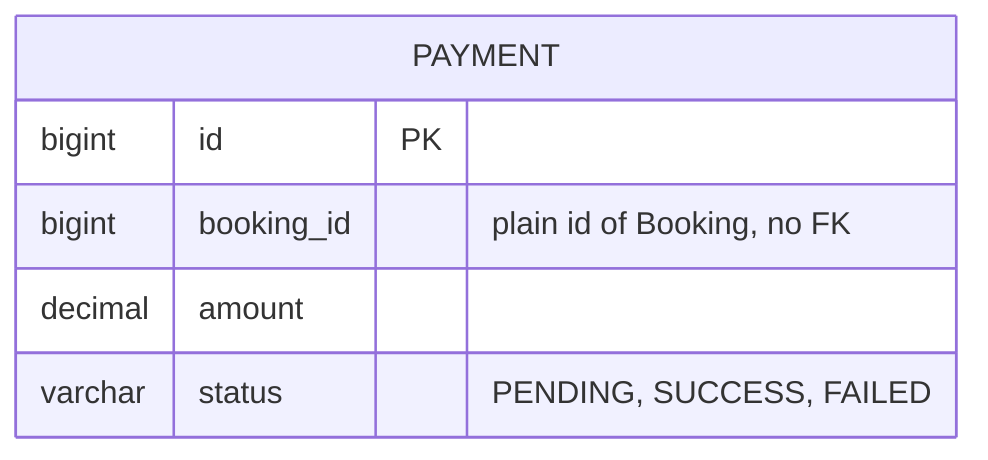

---

## Phase 7: Kafka, Saga, and Outbox

**Added**
- `refund` (Payment service)
- `outbox_event` (Booking and Payment services)
- `processed_message` (Booking, Payment, and Notification services)

**Changed**
- `booking.status` adds `CREATED` and `PAYMENT_FAILED`.
- `payment.status` adds `REFUNDED`.

**Removed:** nothing

**Design notes**
- Each service keeps its own copy of `outbox_event` and `processed_message`. They are never shared.
- `outbox_event` is saved in the same transaction as the business data.
- `processed_message.message_id` is the primary key, so a repeated message fails the insert and is skipped.

### Booking service database

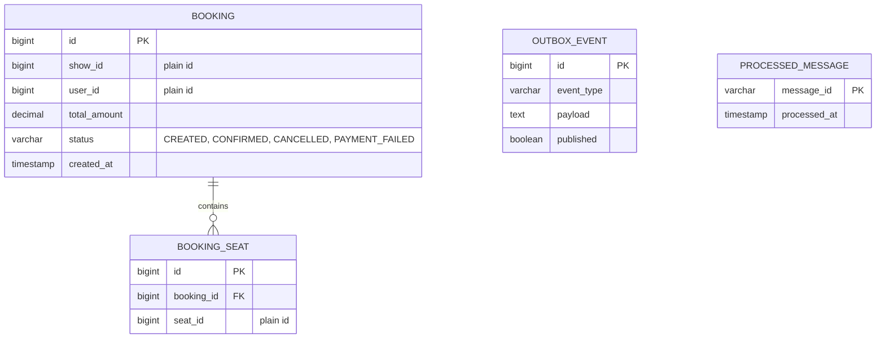

### Payment service database

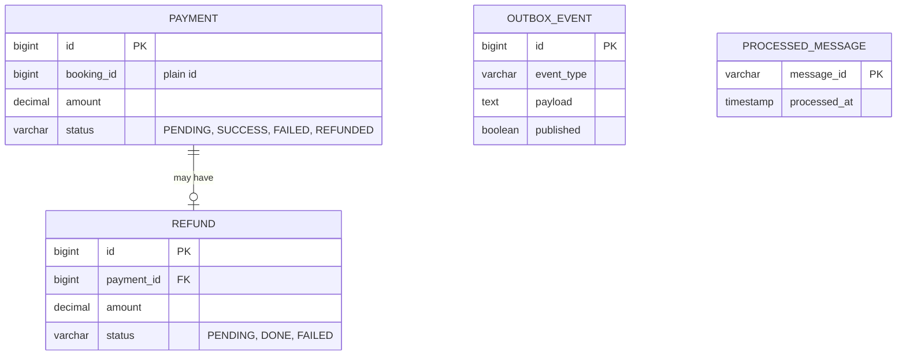

### Notification service database

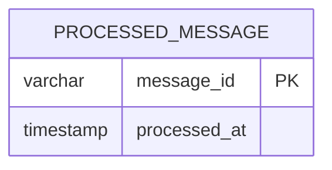

---

## Phase 8: Payments, Webhooks, and Notifications

**Added**
- `idempotency_key` (Booking and Payment services)
- `notification_log` (Notification service)

**Changed:** nothing in existing tables

**Removed:** nothing

**Design notes**
- `idempotency_key.key_value` is the primary key. This unique constraint is the last defense when two requests with the same key arrive together.
- Old keys are removed by a `@Scheduled` cleanup job using `expires_at`.
- `notification_log.booking_id` is a plain number.

This is the final schema of the three services that changed. The User and Cinema databases are the same as Phase 6.

### Booking service database (final)

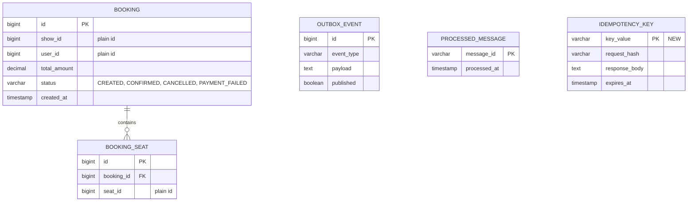

### Payment service database (final)

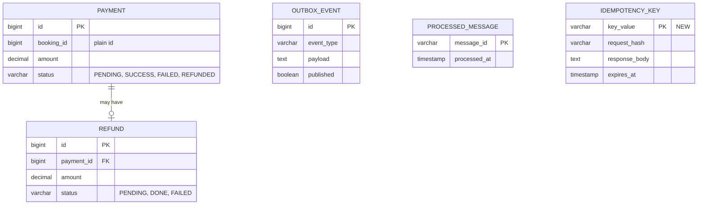

### Notification service database (final)

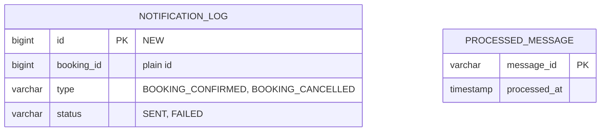

---

## Phase 9: Redis (Caching and Seat Hold)

**Added:** no new tables

**Changed:** nothing in the databases

**Removed:** nothing

Redis holds temporary data. It is not part of the ER diagram. Suggested keys (final names are decided in the steps):

- Seat hold: one key per hold with the show, seats, and user, and a 5-minute TTL
- Cache: movie and show reads in Cinema, with a TTL (add random jitter to avoid a stampede)
- Login attempts: a counter per user or email, with a short TTL, used for rate limiting
- Gateway rate limit: a counter per user, with a short TTL (Phase 10)

---

## Phase 10: Resilience

- No table changes.
- The fake payment gateway gets a setting to respond slowly or fail. This is configuration, not a table.

---

## Phase 11: Observability

- No table changes.
- Trace IDs go into log lines and Kafka message headers, not into tables.

---

## Phase 12: Testing and Delivery

- No table changes.
- Tests run against real Postgres, Kafka, and Redis containers (Testcontainers) using the same Flyway migrations.

---

## Summary: tables added and changed per phase

- Phase 1: add `movie`, `show`, `seat`, `booking`, `booking_seat` (5 tables)
- Phase 2: no change
- Phase 3: no new tables, add indexes and seed data
- Phase 4: change `seat` (add `version`)
- Phase 5: add `users`, `refresh_token` (7 tables). Change `booking.user_id` to a real FK.
- Phase 6: add `payment` (8 tables). Split into four databases. Remove cross-service FKs.
- Phase 7: add `refund`, `outbox_event`, `processed_message` (11 table types). Add statuses `CREATED`, `PAYMENT_FAILED`, `REFUNDED`.
- Phase 8: add `idempotency_key`, `notification_log` (13 table types)
- Phase 9 to 12: no table changes

**Final tables by service**
- User: `users`, `refresh_token`
- Cinema: `movie`, `show`, `seat`
- Booking: `booking`, `booking_seat`, `outbox_event`, `processed_message`, `idempotency_key`
- Payment: `payment`, `refund`, `outbox_event`, `processed_message`, `idempotency_key`
- Notification: `notification_log`, `processed_message`
