# Booking Flow, Phase by Phase (Sequence Diagrams)

The same "book a seat" request, growing from a simple monolith to the final system.
Each phase starts from the previous diagram and changes only what is noted.

---

## Phase 1: Simple monolith

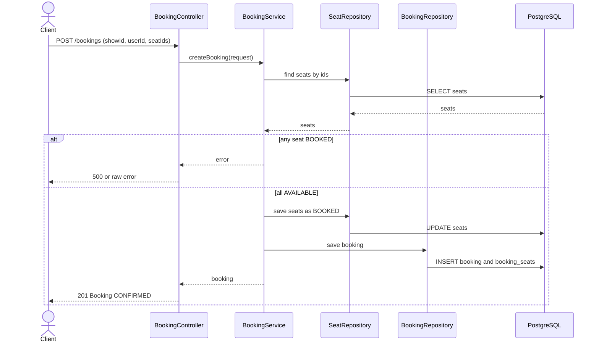

Problem left: no transaction, no clean errors, no login.

---

## Phase 2: Transactions and error handling

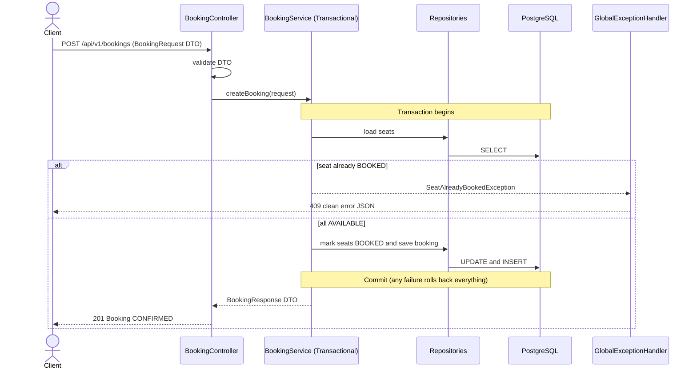

Changed: all-or-nothing booking, DTOs, `/api/v1`, uniform errors, logging.

---

## Phase 3: Database performance

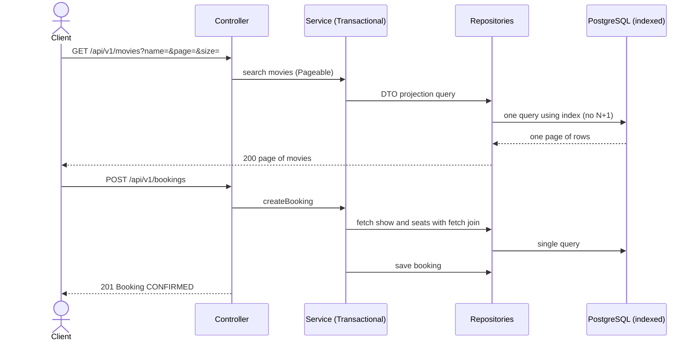

Changed: booking steps same, reads are fast (fetch join, projections, pagination, indexes, tuned pool).

---

## Phase 4: Concurrency and locking

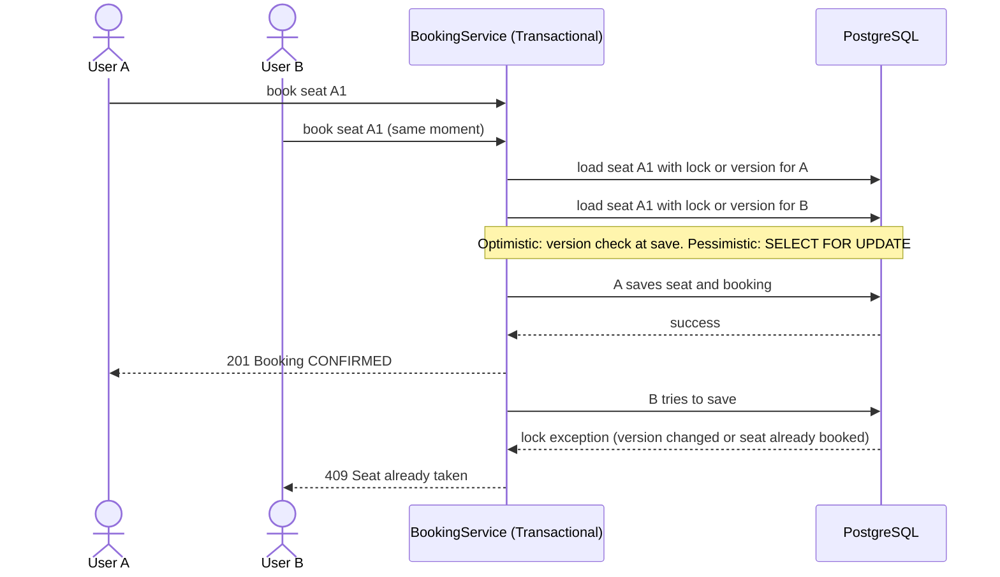

Changed: exactly one booking wins, the other gets a clear 409.

---

## Phase 5: Security (JWT and roles)

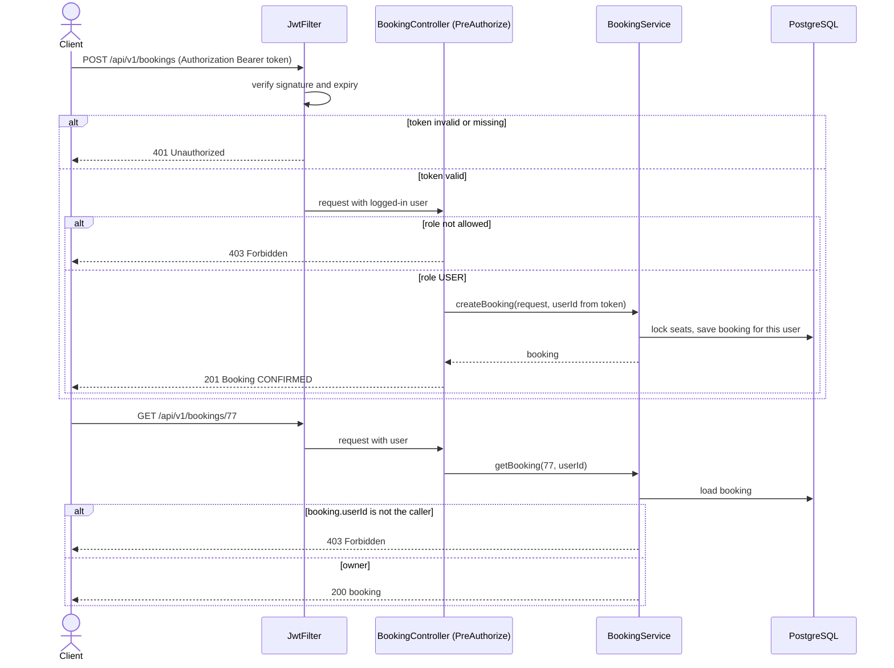

Changed: userId comes from the token, ownership is checked, roles are enforced.

---

## Phase 6: Microservices split

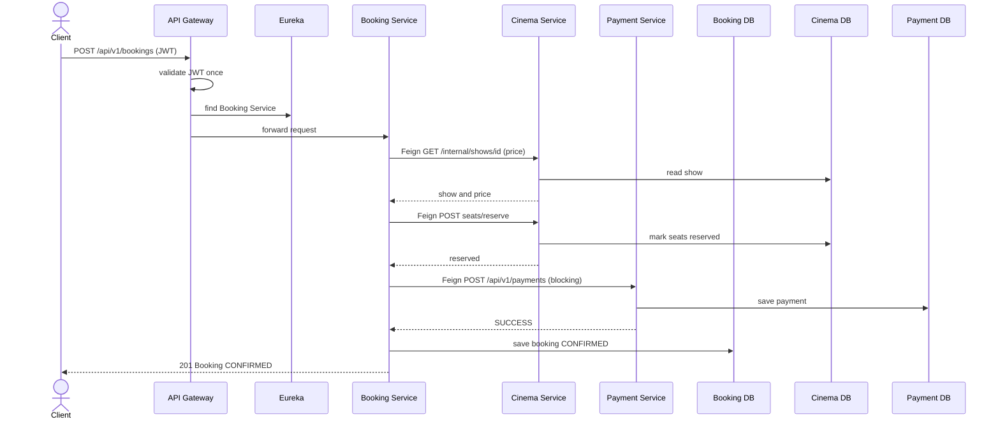

Changed: no single transaction across services, calls go over the network, each service owns its database.
Problem left: if Payment fails after seats are reserved, data goes out of sync.

---

## Phase 7: Kafka, saga, and outbox

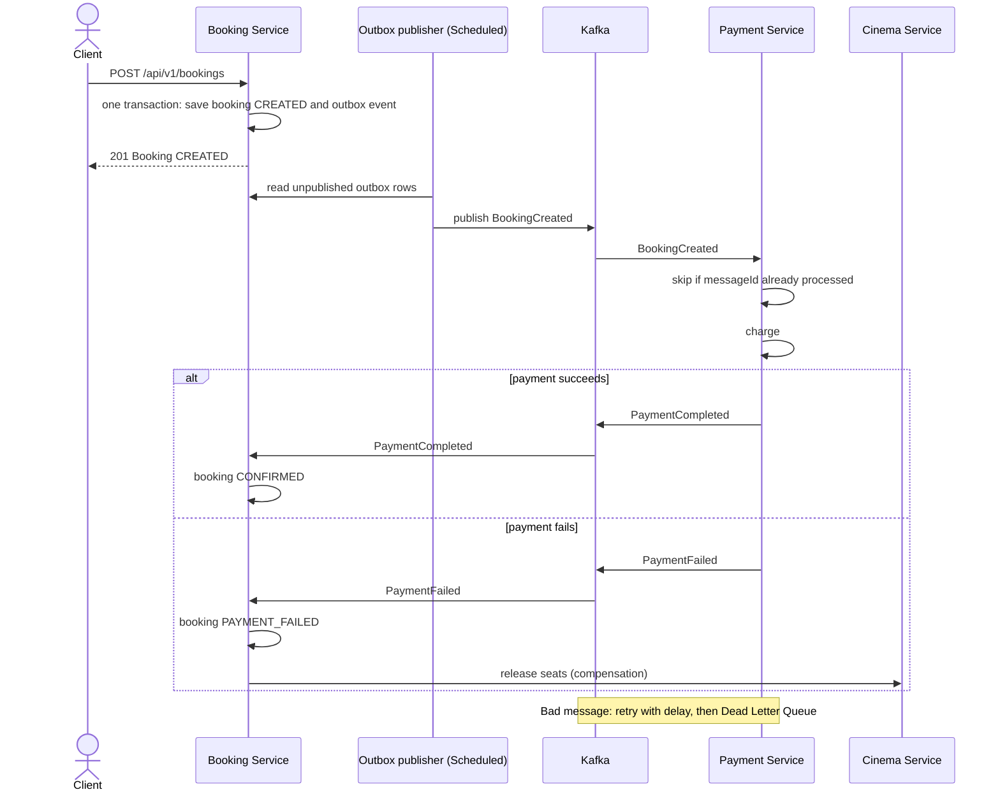

Cancel saga: `POST /bookings/id/cancel` marks cancelled, Payment refunds, Cinema releases seats.

Changed: async events, saga with undo steps, outbox (no lost messages), idempotent consumers (no duplicates), retries and DLQ.

---

## Phase 8: Idempotency, webhooks, notifications

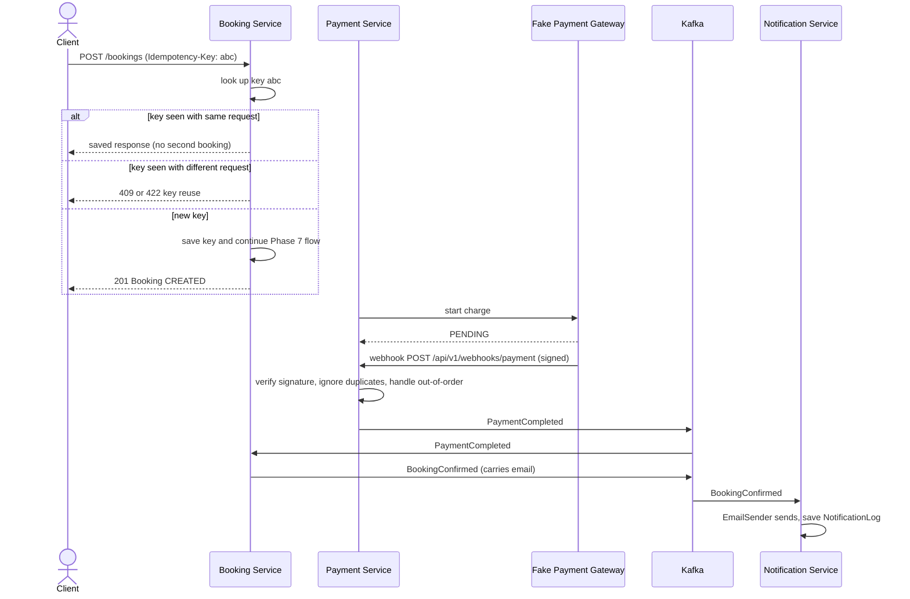

Changed: safe retries, async payment result through webhook, email notification.

---

## Phase 9: Redis (cache and seat hold)

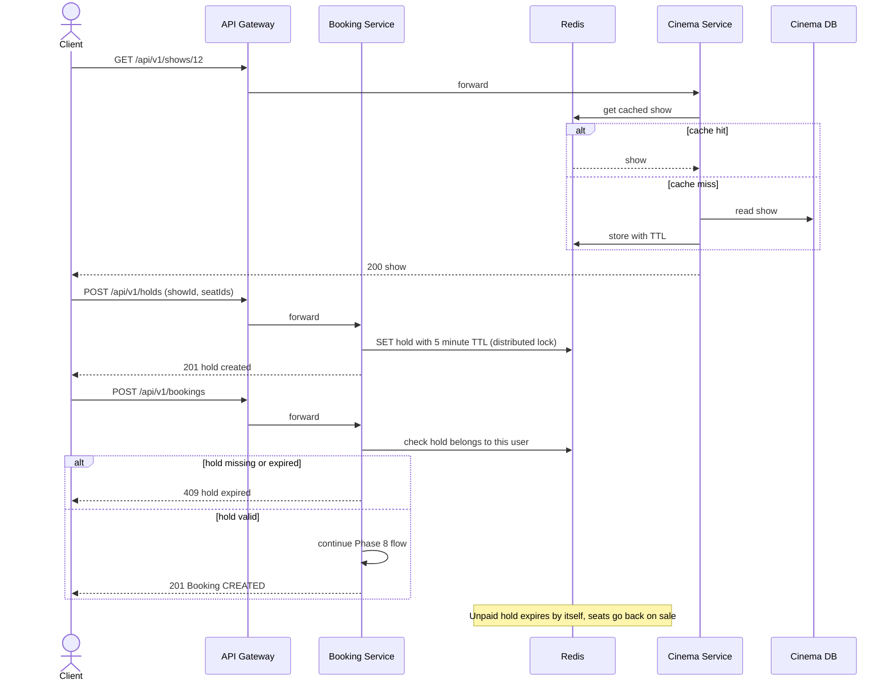

Changed: hold, pay, then confirm or expire. Cached reads. Login rate limit (429) in User service.

---

## Phase 10: Resilience

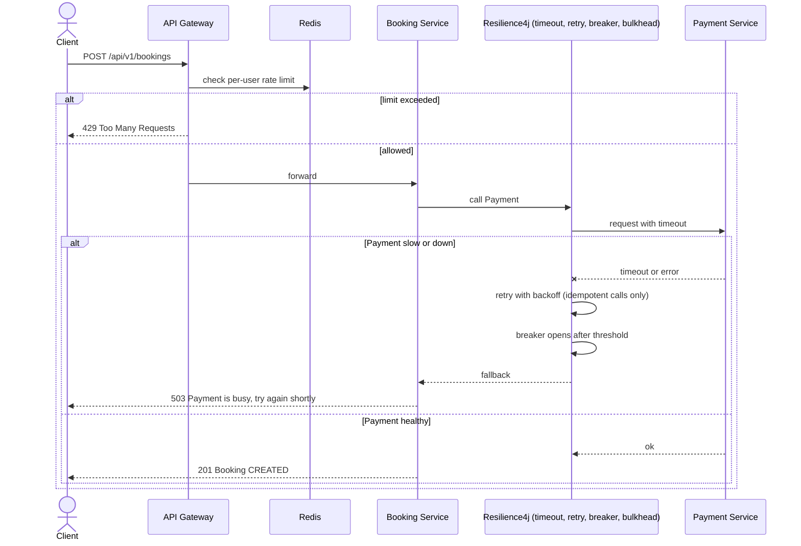

Changed: a failing dependency degrades one feature, browsing stays healthy.

---

## Phase 11: Observability

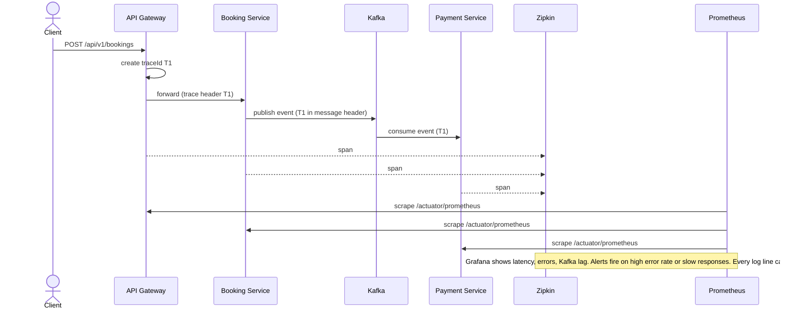

Changed: the booking flow is the same, but you can now see where one request slowed down or failed.

---

## Phase 12: Testing and delivery

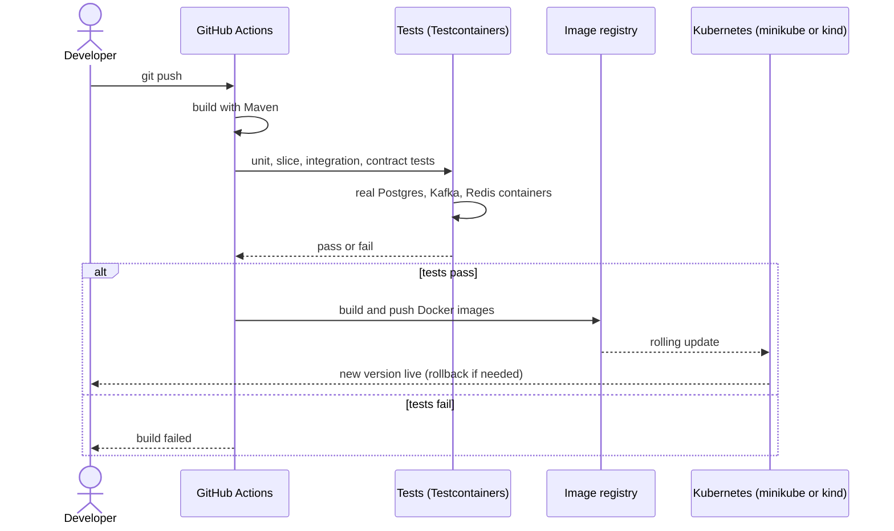

Changed: the booking flow is the same, but every change is built, tested, and packaged automatically.

---

## Summary: what each phase adds to the path

- Phase 1: Controller, Service, Repository, DB
- Phase 2: transaction, DTOs, global error handler
- Phase 3: faster reads (fetch join, projections, pagination, indexes)
- Phase 4: seat locking (optimistic and pessimistic)
- Phase 5: JWT filter, roles, ownership check
- Phase 6: Gateway, Eureka, Feign, separate services and databases
- Phase 7: Kafka, saga, outbox, idempotent consumers, DLQ
- Phase 8: idempotency keys, webhooks, email notifications
- Phase 9: Redis cache, seat hold, distributed lock, rate limit
- Phase 10: timeouts, retry, circuit breaker, bulkhead, fallbacks
- Phase 11: metrics, tracing, correlation IDs, alerts
- Phase 12: tests, Docker, CI, Kubernetes basics
